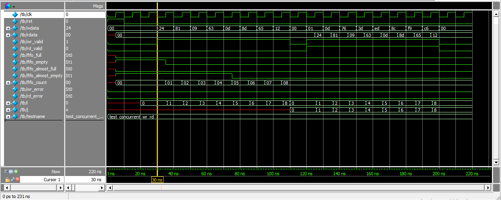
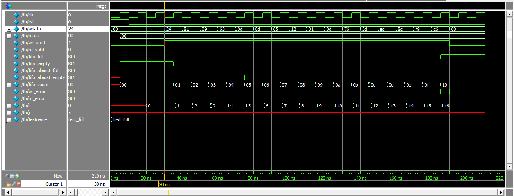
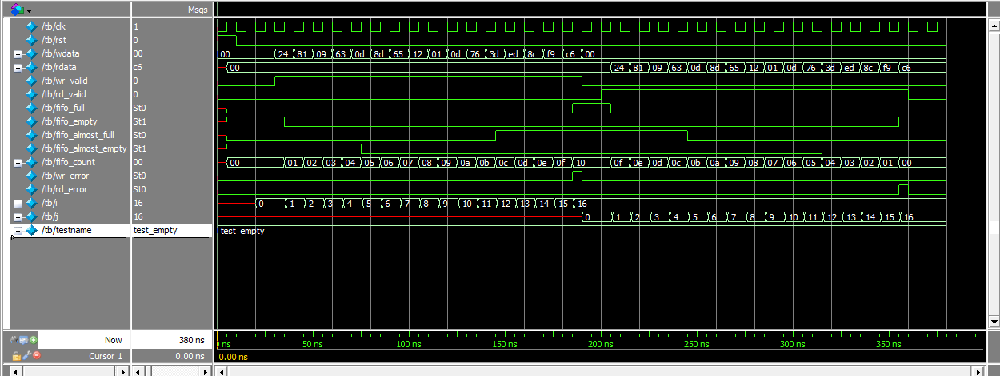
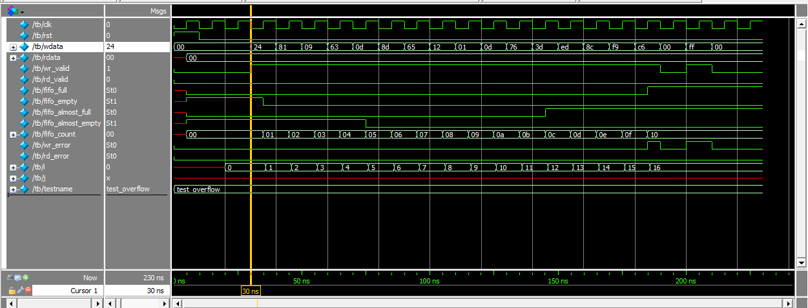
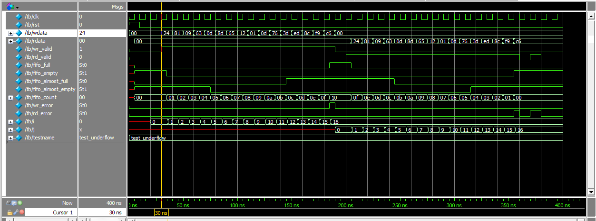

# Synchronous FIFO — RTL Design & Verification



## Overview

This project implements and verifies a **parameterized Synchronous FIFO (First-In-First-Out)** using Verilog/SystemVerilog.

The FIFO uses a single clock for both read and write operations and provides status indications for **full, empty, almost-full, and almost-empty** conditions. The design also detects **write overflow and read underflow** conditions.

A directed SystemVerilog testbench is used to verify the FIFO under normal operating conditions, boundary conditions, error conditions, and simultaneous read/write operations.

---

## ⚙️ FIFO Features

- Parameterized FIFO depth and data width
- Synchronous read and write operations
- FIFO full detection
- FIFO empty detection
- Almost-full detection
- Almost-empty detection
- FIFO occupancy counter
- Write overflow detection
- Read underflow detection
- Simultaneous read and write operation
- Directed testbench with multiple verification scenarios

---

## FIFO Configuration

The FIFO design is parameterized to make the depth and data width configurable.

| Parameter | Description | Simulation Value |
|-----------|-------------|------------------|
| `DEPTH` | Number of entries in the FIFO | `16` |
| `WIDTH` | Width of each FIFO data entry | `8` |
| `ALMOST_FULL_THRESH` | Threshold for almost-full indication | `12` |
| `ALMOST_EMPTY_THRESH` | Threshold for almost-empty indication | `4` |
| `PTR_WIDTH` | Pointer width derived from FIFO depth | `$clog2(DEPTH)` |

Therefore, the FIFO used in this project can store **16 entries of 8-bit data**.

---

## 🔌 Interface Signals

| Signal | Direction | Description |
|--------|-----------|-------------|
| `clk` | Input | FIFO clock |
| `rst` | Input | Synchronous reset |
| `wdata` | Input | Data to be written into the FIFO |
| `rdata` | Output | Data read from the FIFO |
| `wr_valid` | Input | Write request |
| `rd_valid` | Input | Read request |
| `fifo_full` | Output | Indicates that the FIFO is full |
| `fifo_empty` | Output | Indicates that the FIFO is empty |
| `fifo_almost_full` | Output | Indicates that FIFO occupancy has reached the almost-full threshold |
| `fifo_almost_empty` | Output | Indicates that FIFO occupancy has reached the almost-empty threshold |
| `fifo_count` | Output | Current number of stored FIFO entries |
| `wr_error` | Output | Indicates a write attempt when the FIFO is full |
| `rd_error` | Output | Indicates a read attempt when the FIFO is empty |

---

## 🏗️ FIFO Operation

The FIFO stores incoming data in memory and uses separate read and write pointers to maintain the data order.

```text
                  WRITE SIDE
                      │
                      ▼
               ┌──────────────┐
               │              │
   wdata ─────►│              │
   wr_valid ──►│     FIFO     │
   clk ───────►│    MEMORY    │
               │              │
               └───────┬──────┘
                       │
                       ▼
                   READ SIDE
                       │
                       ▼
                     rdata
```

The FIFO follows the basic First-In-First-Out principle:

```text
Write:  Data A → Data B → Data C → Data D

Read:   Data A → Data B → Data C → Data D
```

The `fifo_count` signal tracks the number of valid entries currently stored in the FIFO.

---

# 🧪 Verification

The testbench uses directed test scenarios to exercise important FIFO operating conditions.

Five testcases are implemented:

1. `test_full`
2. `test_empty`
3. `test_overflow`
4. `test_underflow`
5. `test_concurrent_wr_rd`

Each testcase can be selected using the `testname` plusarg.

---

## 1. `test_full` — FIFO Full Condition

### Objective

Verify that the FIFO correctly stores data until its maximum capacity is reached and asserts the `fifo_full` signal.

### Test Operation

The FIFO is written with 16 data values.

The FIFO count increases:

```text
0 → 1 → 2 → ... → 15 → 16
```

When the FIFO reaches its maximum depth:

```text
fifo_count = 16
fifo_full  = 1
```

### Result

The simulation confirms that the FIFO reaches its configured capacity and the full indication is asserted.



---

## 2. `test_empty` — FIFO Empty Condition

### Objective

Verify that data is read in the correct FIFO order and that the FIFO asserts the `fifo_empty` signal after all stored data has been removed.

### Test Operation

The FIFO is first filled with 16 data values.

The data is then read sequentially.

The FIFO count decreases:

```text
16 → 15 → 14 → ... → 1 → 0
```

The data is read in the same order in which it was written.

Example:

```text
Write:
36 → 129 → 9 → 99 → 13 → ...

Read:
36 → 129 → 9 → 99 → 13 → ...
```

At the end of the test:

```text
fifo_count = 0
fifo_empty = 1
```

### Result

The simulation confirms correct FIFO ordering and detection of the empty condition.



---

## 3. `test_overflow` — Write Overflow

### Objective

Verify that the FIFO detects an attempt to write additional data when it is already full.

### Test Operation

The FIFO is first filled with 16 entries.

After the FIFO becomes full, an additional write operation is attempted.

Expected condition:

```text
fifo_full = 1
wr_error  = 1
```

### Result

The simulation confirms that the write overflow condition is detected.



---

## 4. `test_underflow` — Read Underflow

### Objective

Verify that the FIFO detects an attempt to read data when it is empty.

### Test Operation

The FIFO is filled and then completely drained.

After the final data is read:

```text
fifo_count = 0
fifo_empty = 1
```

An additional read operation is then attempted.

Expected condition:

```text
rd_error = 1
```

### Result

The simulation confirms that the read underflow condition is detected.



---

## 5. `test_concurrent_wr_rd` — Simultaneous Read and Write

### Objective

Verify that the FIFO can perform read and write operations during the same clock cycle.

### Test Operation

The FIFO is initially populated with data.

Read and write operations are then performed concurrently.

Example simulation activity:

```text
WRITE[0] : data=1
READ[0]  : data=36

WRITE[1] : data=13
READ[1]  : data=129
```

During the concurrent operation, the FIFO maintains its occupancy:

```text
fifo_count = 8
```

while new data is written and existing data is read.

### Result

The simulation demonstrates simultaneous read/write operation while maintaining FIFO occupancy.


---

# 📊 Verification Summary

| Testcase | Verification Scenario | Expected Result | Status |
|----------|------------------------|-----------------|--------|
| `test_full` | Fill FIFO to maximum capacity | `fifo_full = 1` | ✅ PASS |
| `test_empty` | Read all stored data | `fifo_empty = 1` | ✅ PASS |
| `test_overflow` | Write when FIFO is full | `wr_error = 1` | ✅ PASS |
| `test_underflow` | Read when FIFO is empty | `rd_error = 1` | ✅ PASS |
| `test_concurrent_wr_rd` | Simultaneous read and write | FIFO continues operation | ✅ PASS |

---

# 📈 Simulation Results

The simulation transcripts are included in the repository for each verification scenario.

The results demonstrate:

- FIFO count increasing during write operations
- FIFO count decreasing during read operations
- `fifo_full` assertion at maximum capacity
- `fifo_empty` assertion when the FIFO is drained
- `fifo_almost_full` assertion near maximum capacity
- `fifo_almost_empty` assertion near empty condition
- Write overflow detection
- Read underflow detection
- Simultaneous read/write operation

---

# 📁 Repository Structure

```text
Synchronous_FIFO/
│
├── Design_code/
│   └── synchronous_fifo.v
│
├── Testbench/
│   └── tb_synchronous_fifo.v
│
├── Sim_log_files/
│   ├── test_full.txt
│   ├── test_empty.txt
│   ├── test_overflow.txt
│   ├── test_underflow.txt
│   └── test_concurrent_wr_rd.txt
│
├── Timing_waves/
│   ├── test_full.png
│   ├── test_empty.png
│   ├── test_overflow.png
│   ├── test_underflow.png
│   └── test_concurrent_wr_rd.png
│
└── README.md
```

---

# 🛠️ Tools Used

- **Verilog/SystemVerilog** — RTL design and testbench development
- **QuestaSim** — RTL simulation and waveform analysis
- **Git/GitHub** — Version control and project management

---

# ▶️ Running the Simulation

The testbench supports testcase selection using the `testname` plusarg.

### Full FIFO

```text
+testname=test_full
```

### Empty FIFO

```text
+testname=test_empty
```

### Overflow

```text
+testname=test_overflow
```

### Underflow

```text
+testname=test_underflow
```

### Concurrent Read/Write

```text
+testname=test_concurrent_wr_rd
```

The simulation transcript and waveform can then be used to analyze the behavior of the FIFO for each scenario.

---

# 🔍 Verification Approach

The current verification environment follows a **directed verification approach**.

The testbench specifically targets:

```text
                    FIFO Verification
                           │
          ┌────────────────┼────────────────┐
          │                │                │
          ▼                ▼                ▼
    Normal Operation   Boundary Tests   Error Tests
          │                │                │
     ┌────┴────┐       ┌───┴────┐       ┌───┴────┐
     │         │       │        │       │        │
   Write     Read     Full    Empty   Overflow Underflow
                                     
                           │
                           ▼
                  Concurrent Operation
                           │
                     Read + Write
```

The testbench uses reusable tasks to generate write and read transactions and uses simulation output and waveforms to observe the DUT behavior.

---

# 🚀 Future Improvements

The current project provides directed functional testing of the FIFO. The verification environment can be extended further with:

- SystemVerilog Assertions (SVA)
- Self-checking testbench
- Reference model and scoreboard
- Functional coverage
- Constrained-random stimulus
- Additional corner-case scenarios
- Monitor and checker components
- UVM-based verification environment

These improvements would allow the project to progress from a directed verification environment toward a more advanced reusable verification environment.

---

# 👨‍💻 Author

## Kondaveeti Sri Sri Kali Krishna

**Electronics and Communication Engineering | Design Verification | VLSI**

Interested in RTL Design, SystemVerilog, Functional Verification, and VLSI Design Verification.

---

## ⭐ Project Highlights

This project demonstrates practical experience with:

- Synchronous FIFO architecture
- Parameterized RTL design
- Verilog/SystemVerilog
- FIFO pointers and occupancy counting
- Status flag generation
- Boundary-condition verification
- Overflow and underflow detection
- Concurrent read/write verification
- Directed testbench development
- QuestaSim simulation
- Timing waveform analysis
- GitHub-based project documentation
